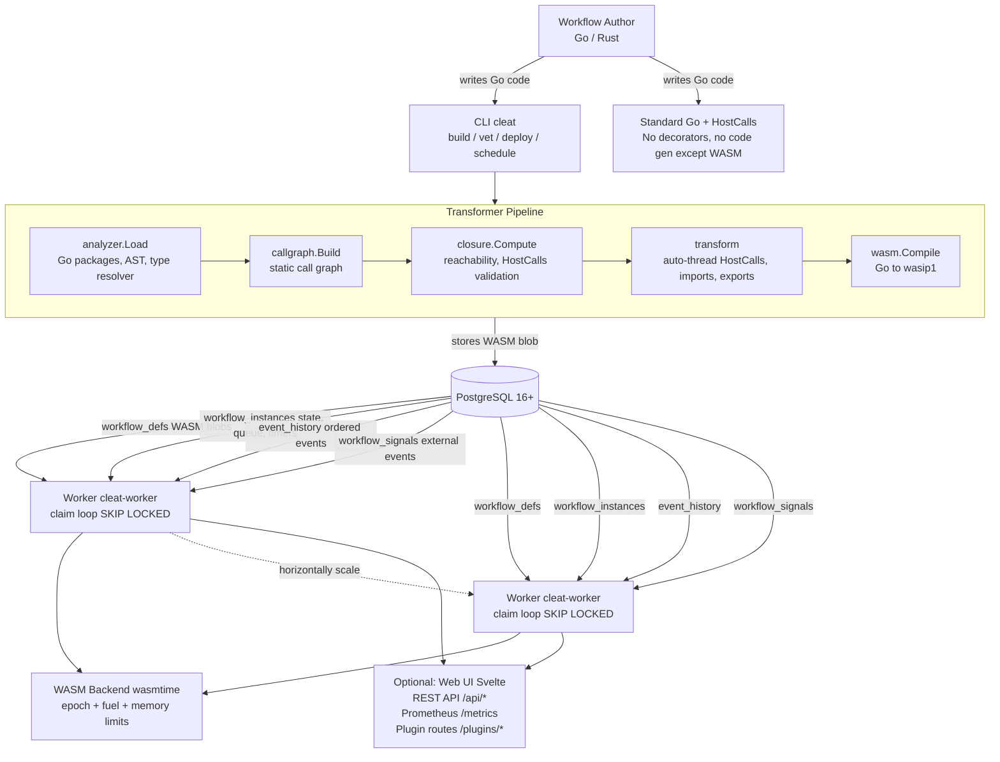
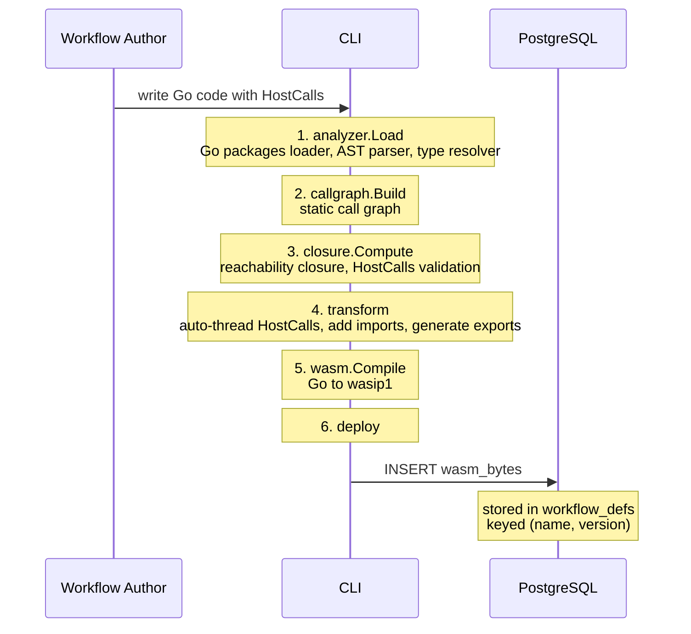
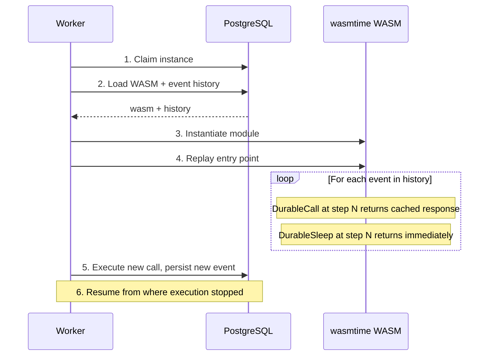

# System Overview

> Corrected 2026-08-09: this page previously framed the whole system as "a
> durable workflow engine on PostgreSQL" with a PostgreSQL-only diagram, and
> is linked from README's documentation table. `tiers.yaml` grants tier-1
> support for three dialects (`postgres`, `mysql`, `mssql`), each with an
> independent, complete implementation of `WorkflowStore` — see
> `docs/reference/database-backends.md`. The diagrams below still show
> PostgreSQL as the representative backend (redrawing three near-identical
> diagrams per dialect would be more duplication than signal), but the prose
> no longer claims PostgreSQL is the only one. Where a dialect differs in a
> way that matters (row-level security, `SKIP LOCKED` support, JSON types),
> see `docs/reference/database-backends.md` and
> `docs/explanation/security-model.md`.

Cleat is a durable workflow engine that runs on PostgreSQL, MySQL, or SQL
Server. Workflows are written in near-standard Go (or Rust, Python, Java, or
AssemblyScript — see `tiers.yaml`), compiled to WebAssembly (WASM), stored in
the database, and executed by stateless worker daemons.

## Architecture Diagram

PostgreSQL is shown below as the representative backend; MySQL and SQL
Server workers follow the identical claim-loop / event-history / signals
flow against their own schema (`docs/reference/database-backends.md`).

## Components

### CLI Tools (`cmd/cleat/`)

The `cleat` CLI provides these commands (re-derived 2026-08-09 via
`cleat --help`; this list previously said "five" and named only the first
five below -- see `docs/reference/cli.md` for the full reference):

| Command | Description |
|---------|-------------|
| `build` | Analyzes Go source, transforms it, compiles to `wasip1` WASM binary |
| `vet` | Validates a workflow package without compiling -- reports entry points, threading errors, closure issues |
| `deploy` | Uploads a compiled WASM binary to the database |
| `versions` | Lists deployed versions of a workflow, latest first |
| `rollback` | Points a workflow name at a previously deployed version |
| `dev` | Runs a workflow locally with live-reload (`--watch`/`-w`) |
| `schedule` | Manages cron schedules for recurring workflow execution |
| `run` | Builds (if needed) and executes a workflow in-process |
| `dag` | Visualizes workflow structure |
| `plugin` | Validates, installs, lists, updates, or uninstalls plugins |
| `lock` | Manages the workflow definition lock file |
| `init` | Scaffolds a new workflow project |

The `cleat-gen` tool generates typed client wrappers from service specs:

| Command | Description |
|---------|-------------|
| `client` | Generates a concrete implementation using `DurableCallTyped` |

### Worker Daemon (`cmd/cleat-worker/`)

The production worker daemon that:

- Polls PostgreSQL for runnable workflow instances using `SELECT ... FOR UPDATE
  SKIP LOCKED`.
- Loads WASM modules and event history for each claimed instance.
- Drives workflow execution via the engine (replay or first-run).
- Persists new events back to PostgreSQL after each step.
- Runs background loops: heartbeat, reaper, schedules, compaction.
- Serves an HTTP API, Prometheus metrics, and an embedded Svelte web UI when
  `--api-addr` is configured.

Workers are stateless and horizontally scalable. Multiple workers can run
concurrently against the same database -- `SKIP LOCKED` ensures each workflow
instance is claimed by exactly one worker.

### PostgreSQL Schema

The database serves four roles:

| Role | Table(s) | Purpose |
|------|----------|---------|
| Blob store | `workflow_defs` | Stores compiled WASM binaries, versioned by (name, version) |
| State store | `workflow_instances`, `event_history` | Tracks instance state and ordered event history |
| Work queue | `workflow_instances` (`status`, `next_wake_at`) | `SKIP LOCKED` claim pattern for work dispatch |
| Timer service | `workflow_instances` (`next_wake_at`) | Sleep/suspend/resume timing via column-based polling |

See [postgresql-schema.md](postgresql-schema.md) for full schema details.

### Web UI

An embedded Svelte single-page application served by the worker daemon when
`--api-addr` is provided. Built files are embedded in the worker binary via
Go `embed.FS`. The UI provides:

- Workflow dashboard with status overview
- Workflow list and detail views (event history, state)
- Schedule management (create, enable, disable)
- DAG visualization of workflow structure

### WASM Backend (wasmtime)

> Corrected 2026-09-06. This section said wasmtime was "the backend of record"
> and wazero "the pure-Go, CGO-less fallback". **There is no fallback and no
> second backend**: `engine/backend_wazero.go` was deleted in #459
> (2026-08-10), a `CGO_ENABLED=0` build constructs no backend at all, and
> `cleat-worker` exits 1 at startup. The host-function count was corrected in
> the same pass, from 59 to 52; it was 54 by 2026-09-13, so that pass removed
> the number rather than correcting it a third time (cleat#1414). See the note
> under the list below, and `docs/explanation/security-model.md` for what
> wazero still does.

Execution uses [wasmtime](https://wasmtime.dev/), which is the only WASM
backend cleat has. It requires CGO. Key characteristics:

- wasmtime requires CGO, and a build without it has no backend: the worker
  logs "wasmtime is the only WASM backend cleat has, there is no fallback"
  and exits 1. Check any worker with `cleat-worker --verify-backend`.
- It implements the `wasip1` preview 1 ABI required by Go's WASM target.
- Host functions registered on the `env` module (`cleat_call`,
  `cleat_call_heartbeat`, `cleat_sleep`, `cleat_now`, etc. -- full list in
  `ABI.md` §2, held to `engine/imports.go` by
  `scripts/check-doc-consistency.sh`). Exactly three carry no `cleat_` prefix --
  `plugin_call`, `plugin_call_streaming`, `set_query_state` -- which is why a
  prefix-anchored scan silently under-counts:

      python3 -c "import re;print(len(set(re.findall(r'\.Export\("([^"]+)"\)',
        open('engine/imports.go').read()))))"

  It read 59 here until today. That was measured 2026-08-09 and was right
  then; #582 and #767 have since removed seven calls between them.
- WASM modules are compiled once and cached in memory keyed by
  `def_name:def_version`.
- String marshalling uses a scratch region in the module's linear memory
  (10 MiB offset; 32 KB output buffer / 64 KB max string length by default
  in `cleat-worker`, each configurable -- see
  `docs/reference/worker-config.md`).

See [wasm-compilation.md](wasm-compilation.md) for the compilation pipeline and
[execution-engine.md](execution-engine.md) for the replay/checkpoint model.

## Data Flow

### Build and Deploy

### Execution (First Run)

### Execution (Replay)

## Key Design Decisions

1. **WASM for versioning, not security** -- The primary motivation for WASM
   compilation is lifecycle decoupling. Workflows may run for weeks and must
   replay against the exact code version they started with. WASM blobs stored
   by (name, version) let v1 workflows continue using v1 code while new
   workflows use v2 on the same worker binary.

2. **The database as sole infrastructure** -- Whichever of PostgreSQL, MySQL,
   or SQL Server you already run serves as blob store, state store, work
   queue, and timer service. No separate message queue, cache, or scheduler
   is needed. This simplifies deployment at the cost of queue throughput at
   extreme scale.

3. **Replay model, not checkpoint serialization** -- Cleat uses Temporal's
   replay approach: re-execute the workflow from step 0, but return cached
   results for already-completed calls. This avoids serializing local variables
   at each checkpoint. The tradeoff is that replay re-does computation between
   API calls; for I/O-bound workflows this is negligible.

4. **Explicit HostCalls boundary** -- Developers mark API boundaries with
   `h.DurableCall(...)`. The original vision of transparent durability proved
   impractical due to interface dispatch, reflection, and static analysis
   limits. The `HostCalls` interface is functionally similar to Temporal's
   `ExecuteActivity` but eliminates the workflow/activity distinction.

5. **Composability through function calls** -- Functions can call other
   functions at arbitrary depth, with durable API calls at any level. The
   transformer computes the transitive closure of durable functions,
   eliminating Temporal's workflow/activity split for most cases.
