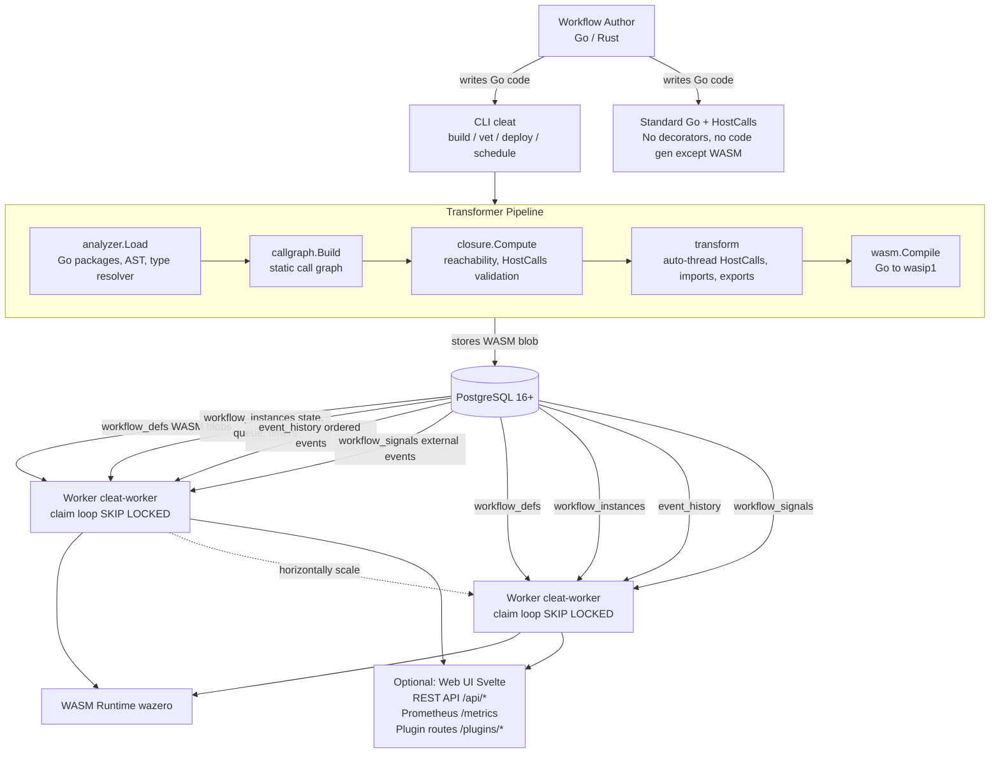
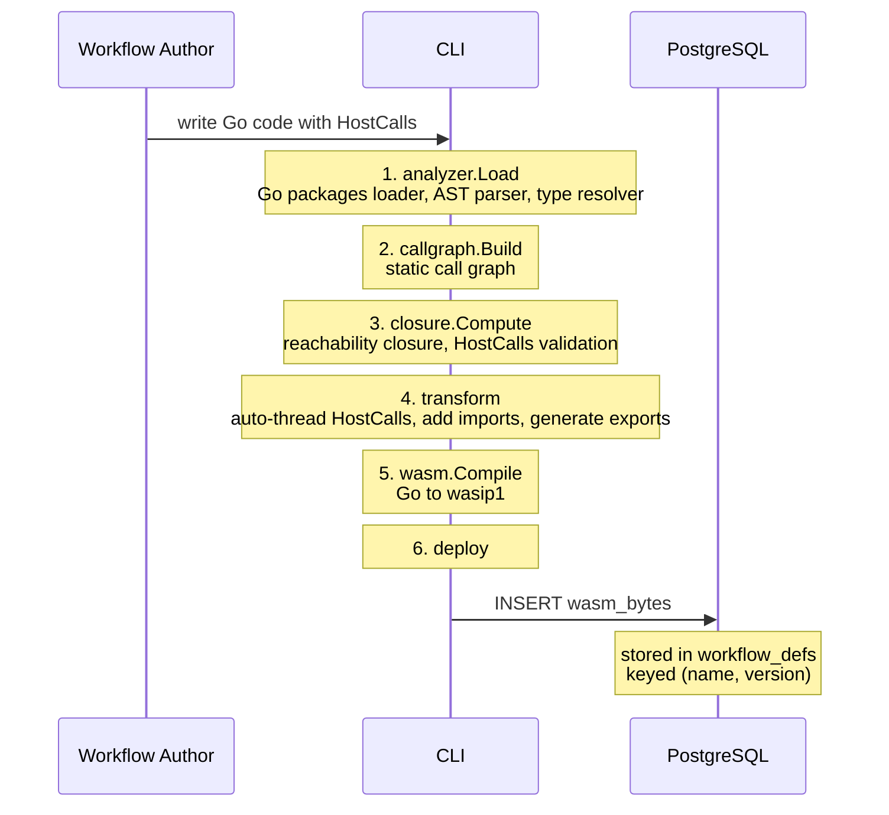
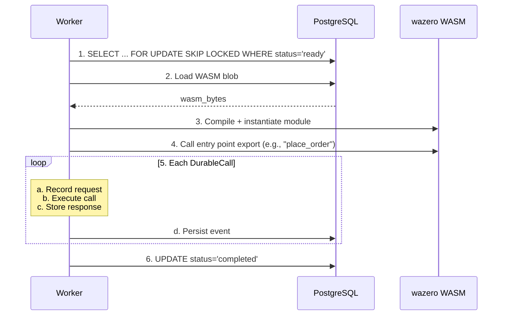
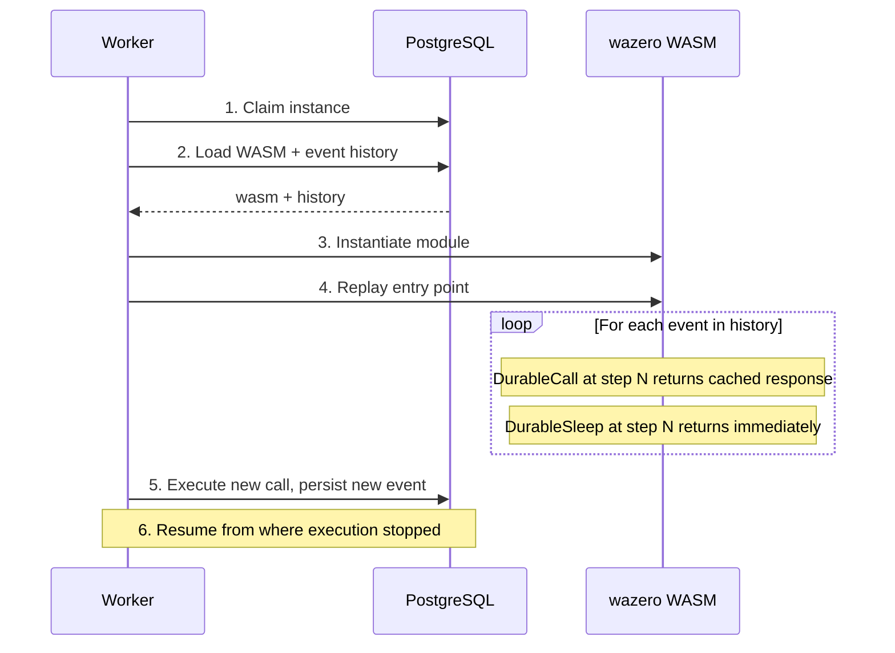

# System Overview

Cleat is a durable workflow engine on PostgreSQL. Workflows are written in
near-standard Go, compiled to WebAssembly (WASM), stored in PostgreSQL, and
executed by stateless worker daemons.

## Architecture Diagram

## Components

### CLI Tools (`cmd/cleat/`)

The `cleat` CLI provides five commands:

| Command | Description |
|---------|-------------|
| `build` | Analyzes Go source, transforms it, compiles to `wasip1` WASM binary |
| `vet` | Validates a workflow package without compiling -- reports entry points, threading errors, closure issues |
| `deploy` | Uploads a compiled WASM binary to PostgreSQL |
| `versions` | Lists deployed versions of a workflow, latest first |
| `schedule` | Manages cron schedules for recurring workflow execution |

The `cleat-gen` tool generates typed client wrappers from service specs:

| Command | Description |
|---------|-------------|
| `client` | Generates a concrete implementation using `DurableCallTyped` |

### Worker Daemon (`cmd/cleat-worker/`)

The production worker daemon that:

- Polls PostgreSQL for runnable workflow instances using `SELECT ... FOR UPDATE
  SKIP LOCKED`.
- Loads WASM modules and event history for each claimed instance.
- Drives workflow execution via the engine (replay or first-run).
- Persists new events back to PostgreSQL after each step.
- Runs background loops: heartbeat, reaper, schedules, compaction.
- Serves an HTTP API, Prometheus metrics, and an embedded Svelte web UI when
  `--api-addr` is configured.

Workers are stateless and horizontally scalable. Multiple workers can run
concurrently against the same database -- `SKIP LOCKED` ensures each workflow
instance is claimed by exactly one worker.

### PostgreSQL Schema

The database serves four roles:

| Role | Table(s) | Purpose |
|------|----------|---------|
| Blob store | `workflow_defs` | Stores compiled WASM binaries, versioned by (name, version) |
| State store | `workflow_instances`, `event_history` | Tracks instance state and ordered event history |
| Work queue | `workflow_instances` (`status`, `next_wake_at`) | `SKIP LOCKED` claim pattern for work dispatch |
| Timer service | `workflow_instances` (`next_wake_at`) | Sleep/suspend/resume timing via column-based polling |

See [postgresql-schema.md](postgresql-schema.md) for full schema details.

### Web UI

An embedded Svelte single-page application served by the worker daemon when
`--api-addr` is provided. Built files are embedded in the worker binary via
Go `embed.FS`. The UI provides:

- Workflow dashboard with status overview
- Workflow list and detail views (event history, state)
- Schedule management (create, enable, disable)
- DAG visualization of workflow structure

### WASM Runtime (wazero)

Execution uses [wazero](https://wazero.io/), a zero-dependency WebAssembly
runtime for Go. Key characteristics:

- No CGo, no external dependencies -- pure Go.
- Implements the `wasip1` preview 1 ABI required by Go's WASM target.
- 15 host functions registered on the `env` module (`cleat_call`,
  `cleat_call_heartbeat`, `cleat_sleep`, `cleat_now`, etc.).
- WASM modules are compiled once and cached in memory keyed by
  `def_name:def_version`.
- String marshalling uses a scratch region in the module's linear memory
  (10MB offset, 64KB output buffer default).

See [wasm-compilation.md](wasm-compilation.md) for the compilation pipeline and
[execution-engine.md](execution-engine.md) for the replay/checkpoint model.

## Data Flow

### Build and Deploy

### Execution (First Run)

### Execution (Replay)

## Key Design Decisions

1. **WASM for versioning, not security** -- The primary motivation for WASM
   compilation is lifecycle decoupling. Workflows may run for weeks and must
   replay against the exact code version they started with. WASM blobs stored
   by (name, version) let v1 workflows continue using v1 code while new
   workflows use v2 on the same worker binary.

2. **PostgreSQL as sole infrastructure** -- PostgreSQL serves as blob store,
   state store, work queue, and timer service. No separate message queue,
   cache, or scheduler is needed. This simplifies deployment at the cost of
   queue throughput at extreme scale.

3. **Replay model, not checkpoint serialization** -- Cleat uses Temporal's
   replay approach: re-execute the workflow from step 0, but return cached
   results for already-completed calls. This avoids serializing local variables
   at each checkpoint. The tradeoff is that replay re-does computation between
   API calls; for I/O-bound workflows this is negligible.

4. **Explicit HostCalls boundary** -- Developers mark API boundaries with
   `h.DurableCall(...)`. The original vision of transparent durability proved
   impractical due to interface dispatch, reflection, and static analysis
   limits. The `HostCalls` interface is functionally similar to Temporal's
   `ExecuteActivity` but eliminates the workflow/activity distinction.

5. **Composability through function calls** -- Functions can call other
   functions at arbitrary depth, with durable API calls at any level. The
   transformer computes the transitive closure of durable functions,
   eliminating Temporal's workflow/activity split for most cases.
