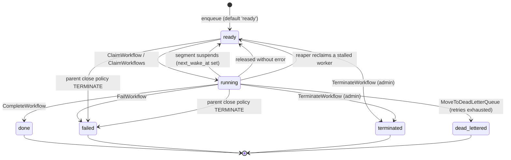

# Workflow lifecycle

Every state a workflow instance can be in, what moves it between them, and which of those states
are terminal.

Derived from the code on **2026-09-02**, not from intent. Every claim below names the file that
implements it, and the enumerations carry the command that re-derives them — because the natural
mental model of this state machine is wrong in two places, and both are recorded here rather than
left to be rediscovered.

---

## The statuses

`workflow_instances.status` is a `TEXT` column with no `CHECK` constraint
(`migrations/postgres/001_schema.sql:227`, default `'ready'`). Six values are ever written today,
and a seventh — `terminating` — has its schema in place but no writer yet (see the defer phase
below):

| status | terminal? | meaning |
|---|---|---|
| `ready` | no | Runnable. A worker may claim it. Covers both "never started" and "sleeping until `next_wake_at`". |
| `running` | no | Claimed by a worker, which is heartbeating. |
| `done` | **yes** | The workflow returned a result. |
| `failed` | **yes** | The workflow failed terminally, or its parent's close policy terminated it. |
| `terminated` | **yes** | Force-terminated by an operator through the admin API. |
| `dead_lettered` | **yes** | Retries exhausted. On the Go SDK this is reachable only through a retry policy short enough to have run on the host — see `IMPROVEMENT-PLAN.md` §3.88. |
| `terminating` | no | **Not yet written by anything.** The defer phase's window: a terminal outcome has been decided and the workflow is running its cleanup before it is applied. Claimable, non-terminal. Schema landed in `migrations/postgres/038`, `mysql/037`, `mssql/041`. |

Re-derive the written set with:

```
grep -rn "UPDATE workflow_instances" -A 3 --include="*.go" engine/ \
  | grep -v _test.go | grep -oE "SET status = '[a-z_]+'" | sort -u
grep -rn "UPDATE workflow_instances" -A 3 migrations/postgres/*.sql \
  | grep -oE "status = '[a-z_]+'" | sort -u
```

Both halves are needed. Some transitions are written in Go and some inside
`finalize_workflow_status`, a PL/pgSQL function; a survey of either alone is incomplete. The Go
command returns all six; the SQL one returns `done`, `failed`, `ready` and `running` only, since
`terminated` and `dead_lettered` are never set from a procedure.

**Scope the grep to `UPDATE workflow_instances`.** An unscoped
`grep -rhoE "SET status = '[a-z_]+'"` also sweeps `promises` and `signals`, which have their own
`status` columns with their own vocabularies (`completed`, `resolved`, `rejected`, `pending`) —
nine values for what is a six-value column.

### `suspended` is not a workflow status

This is the first place the obvious model is wrong. **A sleeping workflow is `ready`, not
`suspended`** — the worker finalizes a suspending segment with `finalStatus = "ready"` and a
`next_wake_at` (`cmd/cleat-worker/setup.go:1801-1805`). Nothing anywhere executes
`SET status = 'suspended'`.

The name survives in three places, and none of them make it a status:

- `validFinalStatus` (`engine/store_lifecycle.go:318`) accepts `"suspended"` — but the Postgres
  `finalize_workflow_status` function has `WHEN 'done' / 'failed' / 'ready'` and `RAISE
  EXCEPTION` on anything else (`migrations/postgres/004_fix_finalize_workflow_status_fence.sql`).
  Passing `"suspended"` would pass the Go check and raise in the database. No caller does: the
  worker passes only `"done"` or `"ready"`.
- Read predicates of the form `WHERE id = $1 AND status IN ('ready', 'suspended')`
  (`engine/store_signals.go:162`, `engine/store_promises.go:52,81`, and the MSSQL equivalents)
  admit a value that is never present. They are correct but the second term is dead.
- Suspension *is* a real concept — it is what the guest does, and the host reports it through
  `SuspendResult`. It is simply not represented in this column.

> Note for migration 004: it is the highest-numbered migration that **defines**
> `finalize_workflow_status`. Later migrations reference it. For anything created with
> `CREATE OR REPLACE`, find the highest-numbered definition before concluding what the procedure
> does — 003 still contains an earlier body.

### There are no status constants

Every status is a string literal, in both Go and SQL. There is no `engine.StatusReady`. A typo in
a status string is caught by a failing test, if one covers that path, and not by the compiler.

---

## The state machine



### What performs each transition

| transition | implementation |
|---|---|
| → `ready` (enqueue) | column default, `migrations/postgres/001_schema.sql:227` |
| `ready` → `running` | `ClaimWorkflow` / `ClaimWorkflows`, `engine/store_lifecycle.go:17,35` |
| `running` → `ready` (suspend, release, reap) | `engine/store_lifecycle.go:565`, `finalize_workflow_status` `WHEN 'ready'`, `ReapStaleInstances` |
| `running` → `done` | `CompleteWorkflow` / `FinalizeWorkflowSegment`, `engine/store_lifecycle.go:223,339` |
| `running` → `failed` | `FailWorkflow`, `engine/store_lifecycle.go:399` |
| `*` → `failed` (parent) | `enforceParentClosePolicy` TERMINATE arm, `engine/store_lifecycle.go:467` |
| `running` → `dead_lettered` | `MoveToDeadLetterQueue`, `engine/store_lifecycle.go:505` |
| `*` → `terminated` | `TerminateWorkflow`, `engine/db.go:1128`, `mysql_ops.go`, `mssql_operations.go` |

### Which terminal transitions close the workflow's children

`enforceParentClosePolicy` runs on every transition that takes a parent out of
the runnable set, on all three dialects: `CompleteWorkflow`, `FailWorkflow`,
`FinalizeWorkflowSegment`, `MoveToDeadLetterQueue`, `ContinueAsNew` (which
closes the current run), `adminForceResolve` (force-complete and force-fail),
and — since 2026-09-02 — `TerminateWorkflow`.

Re-derive with
`grep -rn "enforceParentClosePolicy(" --include='*.go' engine/ | grep -v _test`
and map each hit to its enclosing `func`; the list above is that mapping on
2026-09-02.

Terminate was the exception until then, and nothing stated why: force-completing
a parent failed its `TERMINATE` children while terminating the same parent left
them running. That is a **behaviour change** for anyone who relied on terminate
being the narrow "stop this one workflow" verb — see `CHANGELOG.md` and
IMPROVEMENT-PLAN §3.79. `ABANDON` children are unaffected on every path.

### Fenced and unfenced transitions — the distinction that matters

Most terminal transitions are **fenced** on `(assigned_to, generation)`: the write applies only
if the worker still owns the claim, and returns `ErrFenceLost` otherwise. That is what makes a
stalled-then-reaped worker unable to overwrite the new owner's result.

Three transitions are **not** fenced, because no worker holds the workflow when they happen. They
set a terminal status with a direct `UPDATE`:

- `TerminateWorkflow`
- `enforceParentClosePolicy`'s TERMINATE arm
- `adminForceResolve` (`engine/store_admin.go:154`)

Re-derive with `grep -rn "SET status = '" --include='*.go' engine/ | grep -v _test` across all
three dialects. These three are the reason the defer phase below needs a design at all: a
workflow that reaches a terminal status this way never had a live instance, so **its registered
defers never ran** (IMPROVEMENT-PLAN §3.75).

---

## The planned defer phase, and the status window it introduces

**Status: durable record landed; nothing writes it yet (§3.75 step 1).** Documented here in
advance because it changes what `terminate` means to a caller, and that change should be visible
before it ships rather than discovered afterwards.

What exists as of 2026-09-03 is the schema and the vocabulary:

| | |
|---|---|
| `workflow_instances.pending_terminal_status` | the outcome to finalize with once the defer phase completes. `NULL` on every row today, which is what "no defer phase is owed" means. |
| `workflow_instances.defer_phase_deadline` | when the reaper may conclude the phase died and re-queue the workflow. Separate from heartbeat staleness on purpose: a phase whose worker vanished is already caught by the heartbeat sweep, so this bounds the *phase* — a workflow cannot sit in `terminating` forever because its defers trap on every attempt. |
| `terminating` | the status for the window, per the visibility condition below. |

`migrations/postgres/038_defer_phase_marker.sql`, `mysql/037`, `mssql/041`. Note the numbers do
not align across dialects and are not meant to; take the next free number above each dialect's
own high-water mark.

**Nothing reads or writes these yet.** The consumer — the defer segment in the executor — and
the producers — the three unfenced transitions — are the remaining work. Until then the columns
are inert and the paragraph at the end of this section still describes current behaviour.

§3.35 phases 1–4 made a workflow's `defer` bodies run on every path where a live instance exists:
success, error, and every kill the host performs. The three unfenced transitions above are the
remainder. Making their defers run requires a live instance, which requires dispatch, which
requires the workflow to be **claimable and non-terminal** — so the terminal transition splits in
two:

1. **Mark, do not finalize.** Record the intended terminal outcome; leave the workflow
   schedulable. Do *not* release its resources yet.
2. **Run a defer segment.** A worker claims it, replays history, runs the defers, and only then
   finalizes with the outcome from step 1 — at which point the resources are released, *after*
   the defers that may have released them.

### The window

Between step 1 and step 2 the workflow is **not yet terminal**. A caller that terminates a
workflow and immediately reads its status will not see `terminated` — it will see the workflow
still in flight, for as long as its defer phase takes.

**This is accepted, deliberately, and is documented rather than hidden.** The decision (2026-09-02)
is that a not-yet-terminal window is acceptable *provided it is explained and visible*. What
follows from that:

- **`terminate` is asynchronous.** It records an intent that will be honoured; it does not
  guarantee the workflow is terminal by the time the call returns. Any caller that currently
  reads status straight after terminating and expects `terminated` needs to poll.
- **The window has its own name.** It is *not* reported as `ready`, which would be indistinguishable
  from a workflow that is simply runnable. A distinct status is what makes the state
  visible — a caller can tell "terminating, running its cleanup" from "running normally".
- **The workflow is not re-executed.** The defer segment replays history to reconstruct the
  instance and runs only the registered defers; the workflow body does not run again.
- **Bounded by a deadline.** `defer_phase_deadline`, swept by the existing `reaperLoop`, so a
  worker that dies mid-defer-phase leaves a workflow the reaper re-queues.

Until this ships, the three unfenced transitions remain terminal-and-immediate, and their defers
do not run at all. That is the status quo, not a regression.

---

## Related

- `IMPROVEMENT-PLAN.md` §3.35 — what `defer` is supposed to be; phases 1–4 shipped.
- `IMPROVEMENT-PLAN.md` §3.75 — the durable record for the defer phase, and why the obvious
  designs are the wrong shape.
- `docs/explanation/execution-engine.md` — how a segment executes.
- `docs/reference/error-codes.md` — what a `failed` workflow's `error_code` means.
