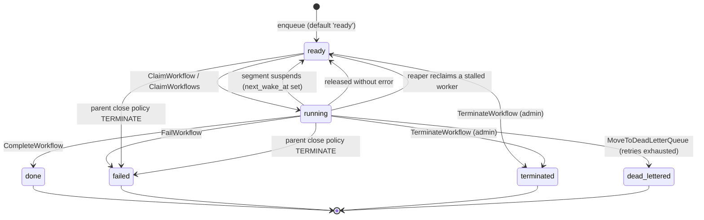

# Workflow lifecycle

Every state a workflow instance can be in, what moves it between them, and which of those states
are terminal.

Derived from the code on **2026-09-02**, and revised on **2026-09-04** when the defer phase
gained its first writer (IMPROVEMENT-PLAN §3.112) — not from intent. Every claim below names the file that
implements it, and the enumerations carry the command that re-derives them — because the natural
mental model of this state machine is wrong in two places, and both are recorded here rather than
left to be rediscovered.

---

## The statuses

`workflow_instances.status` is a `TEXT` column with no `CHECK` constraint
(`migrations/postgres/001_schema.sql:227`, default `'ready'`). Seven values are written; the
seventh, `terminating`, gained its writer on 2026-09-04 (see the defer phase below):

| status | terminal? | meaning |
|---|---|---|
| `ready` | no | Runnable. A worker may claim it. Covers both "never started" and "sleeping until `next_wake_at`". |
| `running` | no | Claimed by a worker, which is heartbeating. |
| `done` | **yes** | The workflow returned a result. |
| `failed` | **yes** | The workflow failed terminally, or its parent's close policy terminated it. |
| `terminated` | **yes** | Force-terminated by an operator through the admin API. |
| `dead_lettered` | **yes** | Retries exhausted. On the Go SDK this is reachable only through a retry policy short enough to have run on the host — see `IMPROVEMENT-PLAN.md` §3.88. |
| `terminating` | no | The defer phase's window: a terminal outcome has been decided and the workflow is running its cleanup before it is applied. Claimable, non-terminal. Written by `TerminateWorkflow`, by `enforceParentClosePolicy`'s TERMINATE arm, and since 2026-09-13 by force-complete and force-fail — in each case only when the workflow has registered defers; cleared by `FinalizeDeferPhase` or by the deadline sweep. Schema in `migrations/postgres/038`, `mysql/037`, `mssql/041`. |

Re-derive the written set with:

```
grep -rn "UPDATE workflow_instances" -A 3 --include="*.go" engine/ \
  | grep -v _test.go | grep -oE "SET status = '[a-z_]+'" | sort -u
grep -rn "UPDATE workflow_instances" -A 3 migrations/postgres/*.sql \
  | grep -oE "status = '[a-z_]+'" | sort -u
```

Both halves are needed. Some transitions are written in Go and some inside
`finalize_workflow_status`, a PL/pgSQL function; a survey of either alone is incomplete. The Go
command returns all six; the SQL one returns `done`, `failed`, `ready` and `running` only, since
`terminated` and `dead_lettered` are never set from a procedure.

**Scope the grep to `UPDATE workflow_instances`.** An unscoped
`grep -rhoE "SET status = '[a-z_]+'"` also sweeps `promises` and `signals`, which have their own
`status` columns with their own vocabularies (`completed`, `resolved`, `rejected`, `pending`) —
nine values for what is a six-value column.

### `suspended` is not a workflow status

This is the first place the obvious model is wrong. **A sleeping workflow is `ready`, not
`suspended`** — the worker finalizes a suspending segment with `finalStatus = "ready"` and a
`next_wake_at` (`cmd/cleat-worker/setup.go:1801-1805`). Nothing anywhere executes
`SET status = 'suspended'`.

The name survives in three places, and none of them make it a status:

- `validFinalStatus` (`engine/store_lifecycle.go:318`) accepts `"suspended"` — but the Postgres
  `finalize_workflow_status` function has `WHEN 'done' / 'failed' / 'ready'` and `RAISE
  EXCEPTION` on anything else (`migrations/postgres/004_fix_finalize_workflow_status_fence.sql`).
  Passing `"suspended"` would pass the Go check and raise in the database. No caller does: the
  worker passes only `"done"` or `"ready"`.
- Read predicates of the form `WHERE id = $1 AND status IN ('ready', 'suspended')`
  (`engine/store_signals.go:162`, `engine/store_promises.go:52,81`, and the MSSQL equivalents)
  admit a value that is never present. They are correct but the second term is dead.
- Suspension *is* a real concept — it is what the guest does, and the host reports it through
  `SuspendResult`. It is simply not represented in this column.

> Note for migration 004: it is the highest-numbered migration that **defines**
> `finalize_workflow_status`. Later migrations reference it. For anything created with
> `CREATE OR REPLACE`, find the highest-numbered definition before concluding what the procedure
> does — 003 still contains an earlier body.

### There are no status constants

Every status is a string literal, in both Go and SQL. There is no `engine.StatusReady`. A typo in
a status string is caught by a failing test, if one covers that path, and not by the compiler.

### Duplicate calls: one policy, every endpoint

**A request repeated under the same `Idempotency-Key` returns the original response — same status,
same field names — plus one standard flag.** cleat#1169.

```
idempotent_replay: false    this is the original call
idempotent_replay: true     this is a replay of one
```

The flag is a **boolean**, present on both, and spelled the same on every endpoint. A caller that
does not care about retries needs no special case; one that cares reads one field.

| endpoint | first call | repeated under the same key |
|---|---|---|
| `POST /api/workflows/<name>/start` | `201 {"id":…}` | `201 {"id":…, "idempotent_replay":true, "status":…}` |
| `POST /api/dead-letters/<id>/reprocess` | `201 {"id":…}` | `201 {"id":…, "idempotent_replay":true}` |
| `POST /api/workflows/<id>/signal` | `200 {"status":"delivered"}` | `200 {"status":"delivered", "idempotent_replay":true}` |

**Two things this deliberately does not change.**

*A key reused with a **different** payload is still refused* — `409 idempotency_key_input_mismatch`
(cleat#1170). Replay answers "you already did this"; a changed payload means you did something else,
and returning the first result would hide that.

*A request with **no** key keeps its old behaviour.* No header means no token, not an empty one — so
two callers who both send nothing do not collide, and a caller may still send the same signal twice
on purpose. The flag is present and `false`.

**Not yet uniform:** `POST /api/schedules` creates work and does not read `Idempotency-Key`. It
deduplicates by the client-supplied name and answers `409 schedule_exists` for a collision, which is
a different question from a retry — and without a key it cannot tell the two apart. Tracked
separately.

### The HTTP API returns this column verbatim

A duplicate start — `POST /api/workflows/<name>/start` re-sent with the same `Idempotency-Key` —
answers with **the original response plus the standard replay flag** (cleat#1169): same `201`, same
`id` field, so a caller that never thinks about retries needs no special case.

```json
{"id": "e39ede1b-…", "idempotent_replay": true, "status": "ready"}
```

The first call answers the same shape with `"idempotent_replay": false`. The flag is present on
both, so a caller can read it unconditionally rather than inferring "original" from an absent field.

> **Changed in cleat#1169.** This used to answer `200` with
> `{"already_started": "true", "workflow_id": …}` — a different status, a different marker and a
> different name for the identifier. A caller reading only `id` got nothing back from a
> deduplicated response and concluded its retry had started a *second* workflow, which is wrong in
> the alarming direction. `reprocess` and the signal endpoint changed with it; all three now carry
> `idempotent_replay`.

**`status` is `workflow_instances.status` copied, not a separate API vocabulary.** Every value in
the table above can appear, plus one that is not a workflow status at all:

| value | meaning |
|---|---|
| any of the seven above | the winner's current lifecycle status |
| `unknown` | the winner could not be read. Stated rather than omitted, so a caller can tell "I cannot tell you" from "I forgot to tell you". |

`unknown` is reachable on a correct tree: a start that is *rejected* records an `idempotency_keys`
row carrying an `error_msg` and no surviving instance, which is why that column carries no foreign
key to `workflow_instances`.

**Branch on terminal versus non-terminal, not on `running`.** A retrying caller is, by definition,
asking about work that may still be outstanding — and outstanding work is usually `ready`, not
`running`. Anything that sleeps, awaits a child, waits on a signal or backs off a retry is `ready`
for nearly all of its life; `running` covers only the slices when a worker holds it. Measured on a
run whose single act is an 8-second `DurableSleepMs`, polled every 500 ms: twenty consecutive
`ready` samples, then `done` — not one `running` (cleat#1325).

A client that needs to separate "never claimed" from "sleeping" must read `next_wake_at`; the
status alone does not distinguish them, per the `ready` row above. That conflation has already
cost one test its discriminating power: a case written to hold a winner open kept passing when its
sleep parameter went unbound, because a 50 ms run and a 20 s sleep are both `ready`.


---

## The state machine



### What performs each transition

| transition | implementation |
|---|---|
| → `ready` (enqueue) | column default, `migrations/postgres/001_schema.sql:227` |
| `ready` → `running` | `ClaimWorkflow` / `ClaimWorkflows`, `engine/store_lifecycle.go:17,35` |
| `running` → `ready` (suspend, release, reap) | `engine/store_lifecycle.go:565`, `finalize_workflow_status` `WHEN 'ready'`, `ReapStaleInstances` |
| `running` → `done` | `CompleteWorkflow` / `FinalizeWorkflowSegment`, `engine/store_lifecycle.go:223,339` |
| `running` → `failed` | `FailWorkflow`, `engine/store_lifecycle.go:399` |
| `*` → `failed` (parent) | `enforceParentClosePolicy` TERMINATE arm, `engine/store_lifecycle.go:467` |
| `running` → `dead_lettered` | `MoveToDeadLetterQueue`, `engine/store_lifecycle.go:505` |
| `*` → `terminated` | `TerminateWorkflow`, `engine/db.go:1128`, `mysql_ops.go`, `mssql_operations.go` |

### Which terminal transitions close the workflow's children

`enforceParentClosePolicy` runs on every transition that takes a parent out of
the runnable set, on all three dialects: `CompleteWorkflow`, `FailWorkflow`,
`FinalizeWorkflowSegment`, `MoveToDeadLetterQueue`, `ContinueAsNew` (which
closes the current run), `adminForceResolve` (force-complete and force-fail),
and — since 2026-09-02 — `TerminateWorkflow`.

Re-derive with
`grep -rn "enforceParentClosePolicy(" --include='*.go' engine/ | grep -v _test`
and map each hit to its enclosing `func`; the list above is that mapping on
2026-09-02.

Terminate was the exception until then, and nothing stated why: force-completing
a parent failed its `TERMINATE` children while terminating the same parent left
them running. That is a **behaviour change** for anyone who relied on terminate
being the narrow "stop this one workflow" verb — see `CHANGELOG.md` and
IMPROVEMENT-PLAN §3.79. `ABANDON` children are unaffected on every path.

### Fenced and unfenced transitions — the distinction that matters

Most terminal transitions are **fenced** on `(assigned_to, generation)`: the write applies only
if the worker still owns the claim, and returns `ErrFenceLost` otherwise. That is what makes a
stalled-then-reaped worker unable to overwrite the new owner's result.

Three transitions are **not** fenced, because no worker holds the workflow when they happen. They
set a terminal status with a direct `UPDATE`:

- `TerminateWorkflow` — **only when the workflow owes no cleanup.** Since 2026-09-04 a workflow
  with registered defers takes the two-phase transition below instead, and its terminal status is
  then written by `FinalizeDeferPhase`, which *is* fenced on the defer segment's own claim.
- `enforceParentClosePolicy`'s TERMINATE arm — **same qualification, same date.** A child that
  owes cleanup goes to `terminating` carrying `pending_terminal_status = 'failed'`; a child that
  owes none is failed here as before.
- `adminForceResolve` (force-complete and force-fail) — **same qualification since 2026-09-13.**
  A workflow that owes cleanup goes to `terminating` carrying the operator's intended outcome in
  `pending_terminal_status` (`'done'` or `'failed'`), with the result or error written at the same
  time; `FinalizeDeferPhase` applies it once the defers have run. A workflow that owes no cleanup
  is resolved directly, as before.

  **This reverses `tiers.yaml` D10**, which decided on 2026-09-04 that force-resolve would stay
  one-phase. The repository owner reversed it on 2026-09-13 (cleat#1152). D10's objection was not
  wrong, and it is now the documented operator-visible cost — see "What it costs" in the
  defer-phase section below.

Re-derive with `grep -rn "SET status = '" --include='*.go' engine/ | grep -v _test` across all
three dialects. These three are the reason the defer phase below needs a design at all: a
workflow that reaches a terminal status this way never had a live instance, so **its registered
defers never ran** (IMPROVEMENT-PLAN §3.75). All three now run them.

### Which terminal transitions owe a defer phase, and why

The rule is **not** operator-versus-engine, which is the natural but wrong reading. It is whether a
guest is running to drain its defers:

| | who runs the defers | takes the defer phase |
|---|---|---|
| guest exits — `done`, `failed`, `dead_lettered` | the guest, on its way out of the entry point | no |
| host imposes — `terminate`, parent-close `TERMINATE`, force-complete, force-fail | nobody, unless the host replays a segment | **yes** |

`MoveToDeadLetterQueue` is the case most often misread as a gap. It writes `dead_lettered` with a
plain `UPDATE` and no defer check, and it needs none: it is called from `writeTerminalFailure`
(`cmd/cleat-worker/setup.go`) *after* the guest has returned an error out of its entry point, so
the defers have already drained. Asserted by
`ports/dbos-transact-py`'s `test_a_defer_runs_on_a_propagated_failure_and_costs_the_run_its_dlq_place`
in the cleat-ports suite.

---

## The defer phase, and the status window it introduces

**Status: live for all three host-driven terminal transitions.** `TerminateWorkflow` (§3.112) and
the parent-close `TERMINATE` arm (§3.114) since 2026-09-04; `adminForceResolve` (force-complete and
force-fail) since 2026-09-13, when `tiers.yaml` D14 reversed D10. This section describes what they
do, and ends with what the last one costs an operator.

The durable record:

| | |
|---|---|
| `workflow_instances.pending_terminal_status` | the outcome to finalize with once the defer phase completes. `NULL` on every row today, which is what "no defer phase is owed" means. |
| `workflow_instances.defer_phase_deadline` | when the phase gives up. Separate from heartbeat staleness on purpose, and it is a different sweep: a phase whose worker *vanished* is caught by the heartbeat sweep and gets another attempt, so this one bounds the number of ATTEMPTS — a workflow cannot sit in `terminating` forever because its defers trap on every replay. Past it, `ExpireDeferPhases` applies the recorded outcome without the cleanup. |
| `terminating` | the status for the window, per the visibility condition below. |

`migrations/postgres/038_defer_phase_marker.sql`, `mysql/037`, `mssql/041`. Note the numbers do
not align across dialects and are not meant to; take the next free number above each dialect's
own high-water mark. `migrations/postgres/040` widened the cross-tenant claim function to match
the inline claims — a deployment on `--claim-across-tenants` that applied 038 without 040 would
never dispatch a defer phase at all.

**Which workflows take it.** A terminate enters the defer phase only when the workflow has
registered defers — an `EventTypeDefer` row in its history, or a compaction state, which is the
conservative answer because compaction prunes the rows it folds. A workflow with no defers has no
cleanup to run and terminates in one step exactly as before, which is every workflow in most
deployments. `engine/defer_phase.go`'s `deferPhaseOwed` is the whole of that decision.

§3.35 phases 1–4 made a workflow's `defer` bodies run on every path where a live instance exists:
success, error, and every kill the host performs. The three unfenced transitions above are the
remainder. Making their defers run requires a live instance, which requires dispatch, which
requires the workflow to be **claimable and non-terminal** — so the terminal transition splits in
two:

1. **Mark, do not finalize.** Record the intended terminal outcome; leave the workflow
   schedulable. Do *not* release its resources yet.
2. **Run a defer segment.** A worker claims it, replays history, runs the defers, and only then
   finalizes with the outcome from step 1 — at which point the resources are released, *after*
   the defers that may have released them.

### The window

Between step 1 and step 2 the workflow is **not yet terminal**. A caller that terminates a
workflow and immediately reads its status will not see `terminated` — it will see the workflow
still in flight, for as long as its defer phase takes.

**This is accepted, deliberately, and is documented rather than hidden.** The decision (2026-09-02)
is that a not-yet-terminal window is acceptable *provided it is explained and visible*. What
follows from that:

- **`terminate` is asynchronous.** It records an intent that will be honoured; it does not
  guarantee the workflow is terminal by the time the call returns. Any caller that currently
  reads status straight after terminating and expects `terminated` needs to poll.
- **The window has its own name.** It is *not* reported as `ready`, which would be indistinguishable
  from a workflow that is simply runnable. A distinct status is what makes the state
  visible — a caller can tell "terminating, running its cleanup" from "running normally".
- **The workflow is not re-executed.** The defer segment replays history to reconstruct the
  instance and runs only the registered defers; the workflow body does not run again.
- **Bounded by a deadline.** Two different sweeps, and the distinction is the point.
  A worker that *dies* mid-phase is caught by the ordinary heartbeat sweep, which returns the
  workflow to `terminating` for another attempt. `defer_phase_deadline` bounds the number of
  attempts: past it, `ExpireDeferPhases` applies the recorded outcome without the cleanup, so a
  guest that traps on every replay cannot leave a workflow in `terminating` forever. Five minutes
  (`engine/defer_phase.go`).
- **A defer phase never fails the workflow.** Every failure inside it — a trap, a timeout,
  unreadable history, WASM that will not load, a panic — applies the recorded outcome and reports
  the cleanup as lost. Turning a terminate into a `failed` because its *cleanup* went wrong would
  replace an outcome the database had already committed to.

**Which outcome is applied depends on which transition marked the phase**, and the marker is
where that is recorded rather than something the finalize is told: `TerminateWorkflow` records
`terminated`, the parent-close arm records `failed`. One finalize, two outcomes, and nothing
between the phases can substitute a third.

### `adminForceResolve` takes this path too, since 2026-09-13

Force-complete and force-fail were terminal-and-immediate until `tiers.yaml` **D14** reversed
**D10** (cleat#1152). They now mark like the other two when the workflow owes cleanup: the
operator's intended outcome goes into `pending_terminal_status` — `'done'` or `'failed'` rather
than `'terminated'` — with the result or error written alongside it, and `FinalizeDeferPhase`
applies it once the defers have run. `FinalizeDeferPhase` sets `status = pending_terminal_status`
and does not touch `result` or `error_msg`, which is what lets a mechanism built for terminate
carry a force-*complete*'s payload.

A workflow owing no defers is still resolved in one `UPDATE`. Force-resolve has not become
asynchronous in general — only for runs with cleanup outstanding.

**What it costs, and D10 was right about it.** A defer phase requires the guest to replay, so
routing the escape hatch through one makes it depend on the thing that may already be failing:

| the workflow being force-resolved | when the operator's outcome lands |
|---|---|
| owes no defers | immediately, one `UPDATE` |
| owes defers and can replay | after its defer segment runs — seconds |
| owes defers and **cannot** replay | after `defer_phase_deadline`, up to 5 minutes |

`ExpireDeferPhases` applies the recorded outcome once the deadline passes, so an operator always
has recourse — it is no longer instant. **A status of `terminating` straight after a
force-complete is expected**; the row already carries the outcome that will be applied.

What was gained is the other half of D10's own argument. The cleat#1152 census found that
MARK/FINALIZE had **never had a defer to run** — 9,868 workflows, 47 `terminated`, every one
either never executing a body or registering none. These two endpoints were the only ones that
would ever exercise it, so under D10 the two-phase path was untested in production precisely
*because* of D10.

**Force-resolving a workflow that is already in its defer phase** still takes the one-phase arm and
clears the marker, cutting the cleanup short. `deferPhaseOwed` returns false for `terminating`, so
this is the same behaviour as a second `TerminateWorkflow`, and it is what keeps force-resolve
authoritative over a cleanup that is itself stuck. A workflow is never left terminal carrying a
marker the deadline sweep would later act on.

---

## Related

- `IMPROVEMENT-PLAN.md` §3.35 — what `defer` is supposed to be; phases 1–4 shipped.
- `IMPROVEMENT-PLAN.md` §3.75 — the durable record for the defer phase, and why the obvious
  designs are the wrong shape.
- `docs/explanation/execution-engine.md` — how a segment executes.
- `docs/reference/error-codes.md` — what a `failed` workflow's `error_code` means.
